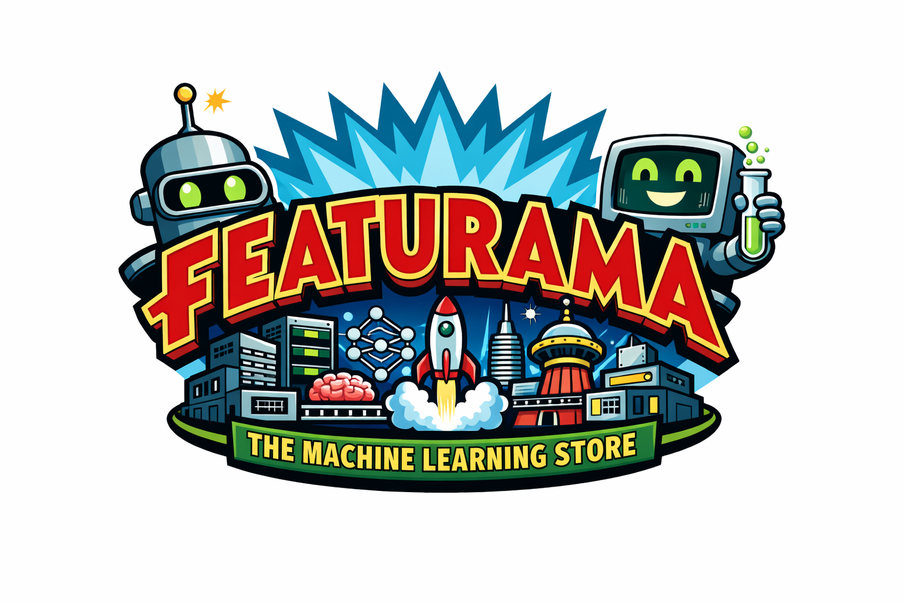

# 🚀 Featurama - The Feature Store of Tomorrow!

> *"Good news, everyone! I've invented a feature store that can handle millions of features faster than you can say 'What-If Machine'!"* - Professor Farnsworth

Featurama is a high-performance feature store built on ScyllaDB, designed to demonstrate efficient storage, retrieval, and serving of millions of high-cardinality features for machine learning pipelines.

## 🎯 Features

- **ScyllaDB Integration**: Lightning-fast feature storage and retrieval with optimized schema design
- **High-Cardinality Data**: Generate and manage millions of features across thousands of entities
- **Pandas & Ray Data**: Seamless integration with popular data processing frameworks
- **ML Pipeline**: Complete end-to-end training, serving, and inference capabilities
- **Futurama Theme**: Because saving the universe requires good features! 🤖

## 🏗️ Architecture

```
Featurama
├── Core Feature Store (API & Logic)
├── ScyllaDB Client (Schema & Queries)
├── Data Generation (Synthetic High-Cardinality Data)
└── ML Pipeline (Training & Inference)
```

## 🚀 Quick Start

### 1. Start ScyllaDB

```bash
docker-compose up -d
```

Wait for ScyllaDB to be healthy (about 30-60 seconds):

```bash
docker-compose ps
```

### 2. Install Dependencies

```bash
pip install -r requirements.txt
```

### 3. Initialize Schema

```bash
python examples/01_setup_scylla.py
```

### 4. Generate High-Cardinality Data

```bash
python examples/02_generate_data.py
```

This generates millions of features for:
- **Characters**: Fry, Bender, Leela, Professor, Zoidberg, and more
- **Planets**: Earth, Mars, Omicron Persei 8, Decapod 10, etc.
- **Deliveries**: Package routes, delivery times, success rates

### 5. Ingest Features

```bash
python examples/03_feature_ingestion.py
```

### 6. Benchmark Feature Retrieval

```bash
python examples/04_feature_retrieval.py
```

### 7. Train ML Model

```bash
python examples/05_train_model.py
```

### 8. Run Inference Server

```bash
python examples/06_inference.py
```

## 📊 Feature Store Capabilities

### Feature Registration
```python
from featurama.core.feature_store import FeatureStore

fs = FeatureStore()
fs.register_feature(
    name="delivery_success_rate",
    feature_type="float",
    description="Rate of successful deliveries",
    version=1
)
```

### Batch Feature Writing
```python
import pandas as pd

features_df = pd.DataFrame({
    'entity_id': ['fry_001', 'bender_002'],
    'feature_name': ['delivery_count', 'delivery_count'],
    'value': [42, 99],
    'timestamp': [datetime.now(), datetime.now()]
})

fs.write_features(features_df)
```

### Online Feature Retrieval
```python
features = fs.get_online_features(
    entity_ids=['fry_001'],
    feature_names=['delivery_count', 'success_rate']
)
```

### Historical Features (Point-in-Time)
```python
historical = fs.get_historical_features(
    entity_ids=['fry_001', 'bender_002'],
    feature_names=['delivery_count'],
    timestamp=datetime(2026, 1, 1)
)
```

## 🎓 ML Pipeline

The included ML pipeline demonstrates:

1. **Feature Engineering**: Aggregations, rolling windows, embeddings
2. **Model Training**: Delivery time prediction using XGBoost
3. **Batch Inference**: Processing large datasets with Ray
4. **Online Serving**: FastAPI server for real-time predictions

## 🗄️ Schema Design

### Feature Metadata
- Tracks feature definitions, types, versions
- Optimized for quick feature lookup

### Feature Values
- Time-series storage with entity_id partitioning
- Clustering by feature_name and timestamp
- Supports point-in-time correctness

### Entity Registry
- Maintains entity catalog (characters, planets, deliveries)
- Entity metadata and grouping

## 🔧 Tech Stack

- **Database**: ScyllaDB 5.4
- **Language**: Python 3.13
- **Data Processing**: Pandas, Ray Data
- **ML**: Scikit-learn, XGBoost
- **API**: FastAPI
- **Data Generation**: Faker

## 📈 Performance

Featurama is designed to handle:
- ✅ Millions of features per entity
- ✅ Thousands of concurrent reads
- ✅ Sub-millisecond feature retrieval
- ✅ Distributed data generation with Ray
- ✅ High-throughput batch ingestion

## 🤝 Contributing

Good news, everyone! Contributions are welcome!

## 📜 License

MIT License - Built for demonstration purposes

## 🎬 Credits

Inspired by Futurama and the need for better feature stores in the year 3000 (and 2026).

*"Shut up and take my features!"* - Bender

